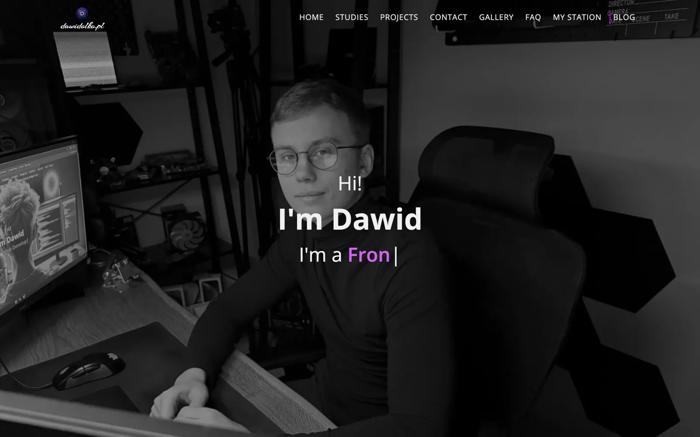
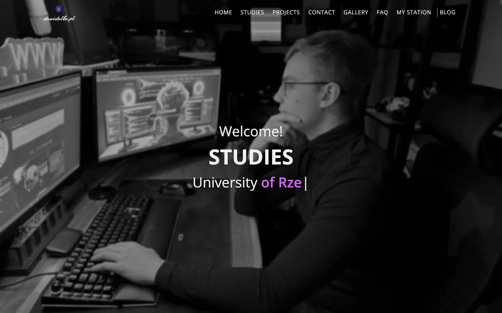
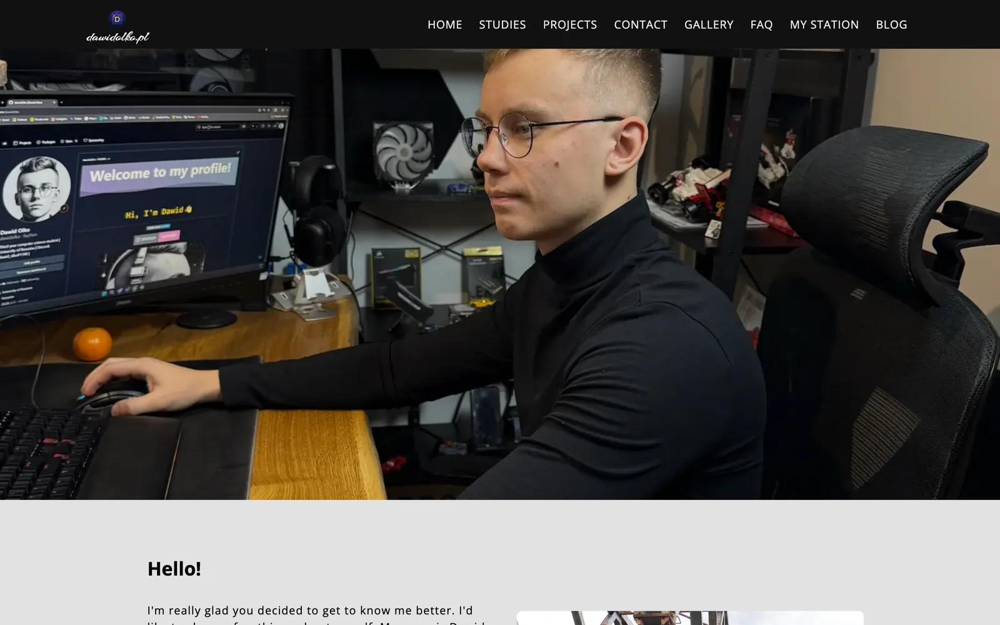
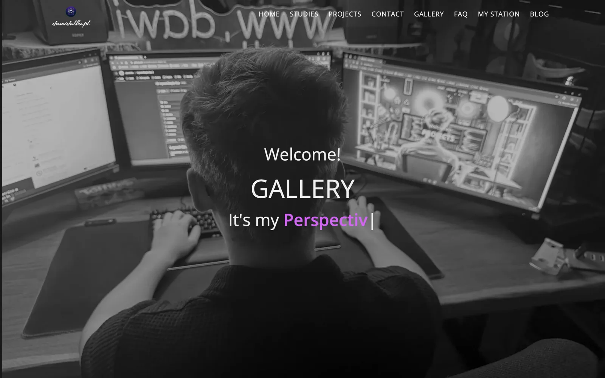
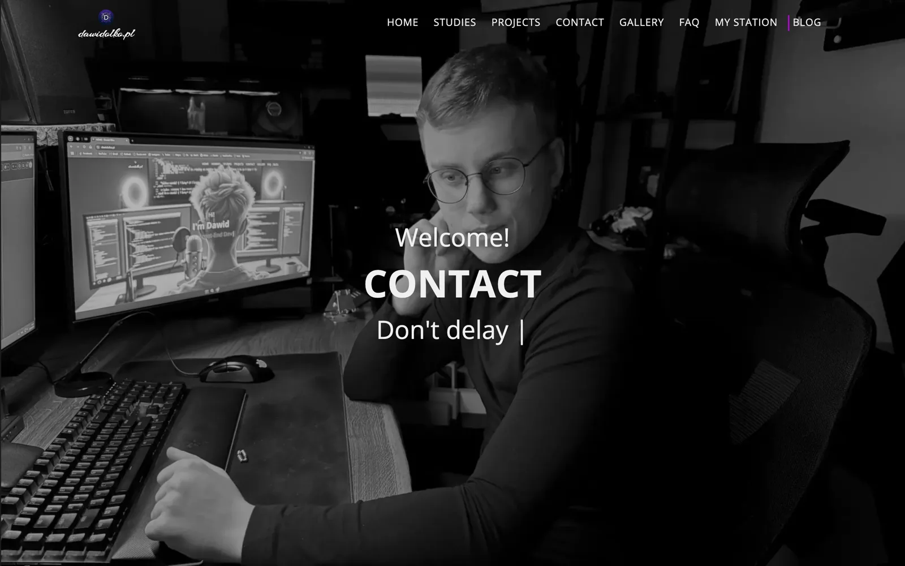

# dawidolko.pl — Personal Website

> 🚀 **Multi-page personal website built from scratch** — projects, studies, blog, gallery and contact, hand-built with semantic HTML, SASS and vanilla JavaScript.

Welcome to the repository behind [**dawidolko.pl**](https://dawidolko.pl) — my personal website and the
central hub of my work. It is a static, multi-page site written without a frontend framework: every page
is semantic HTML, styles are authored in modular SASS, and interactivity is plain ES modules bundled
with webpack. The site collects my projects, academic path, hobbies and a photo blog in one place.

The repository doubles as a demonstration of a classic, dependency-light frontend toolchain — SASS
compilation, webpack bundling, KSS style documentation, JSDoc for scripts, and an image pipeline that
converts source photos to responsive WebP.


---

## 🎯 Key Features

- 🗂️ **Multi-page structure** — Home, Projects, Studies, Blog, Gallery, Hobbies, FAQ and Contact, each a standalone semantic HTML document
- 🧱 **Modular SASS architecture** — styles split into partials and compiled to a single minified stylesheet
- 🖼️ **Responsive image pipeline** — `convert-to-webp.js` and `convert-heic.js` generate WebP variants at multiple widths from source photography
- 📬 **Contact form** — server-side handling through `mail.php`
- 🔍 **SEO foundation** — `robots.txt`, `sitemap.xml`, canonical URLs, Open Graph metadata and Google Search Console verification
- ♿ **Accessible markup** — landmark regions, skip links, labelled controls and descriptive alternative text
- 📚 **Self-documenting** — KSS living style guide for CSS and JSDoc for JavaScript
- ⚡ **No runtime framework** — ships plain HTML, compiled CSS and a small JS bundle

---

## 🖼️ Screenshots

| Home | Projects |
|---|---|
| [](docs/screenshots/home.webp) | [](docs/screenshots/projects.webp) |

| Studies | Blog |
|---|---|
| [](docs/screenshots/studies.webp) | [](docs/screenshots/blog.webp) |

| Gallery | Contact |
|---|---|
| [](docs/screenshots/gallery.webp) | [](docs/screenshots/contact.webp) |

---

## 🛠️ Technology Stack

### Frontend

- **HTML5** — semantic, accessible multi-page markup
- **SASS/SCSS** — modular stylesheets compiled to compressed CSS
- **JavaScript (ES6+)** — vanilla modules, no UI framework

### Build & Tooling

- **webpack 5** — bundling and development server
- **sass** — stylesheet compilation (`build:css` / `watch:css`)
- **sharp** + **heic-convert** — image conversion and responsive WebP generation
- **KSS** — living CSS style guide
- **JSDoc** — JavaScript API documentation

### Backend & Hosting

- **PHP** — `mail.php` handles contact form submissions
- **GitHub Pages** — serves the built site from `docs/`

---

## 🚀 Getting Started

### Prerequisites

- **Node.js** (version 16 or higher)
- **npm** package manager
- **Git** for version control

### 1. Clone the Repository

```bash
git clone https://github.com/dawidolko/dawidolko.pl.git
cd dawidolko.pl
```

### 2. Install Dependencies

```bash
npm install
```

### 3. Start Development Server

```bash
npm start
```

webpack Dev Server opens the site in your browser with live reloading.

### 4. Build for Production

```bash
npm run build      # bundle JavaScript with webpack
npm run build:css  # compile SASS to docs/assets/css/main.css (compressed)
```

To recompile styles continuously while working:

```bash
npm run watch:css
```

### 5. Regenerate Responsive Images (optional)

```bash
node convert-heic.js     # convert HEIC source photos to a web format
node convert-to-webp.js  # produce responsive WebP variants
```

---

## 📁 Project Structure

```
dawidolko.pl/
├── 📄 index.html            # Home page
├── 📄 projects.html         # Projects showcase
├── 📄 studies.html          # Academic background
├── 📄 blog.html             # Blog
├── 📄 gallery.html          # Photo gallery
├── 📄 hobbies.html          # Hobbies
├── 📄 faq.html              # Frequently asked questions
├── 📄 contact.html          # Contact form
├── 📁 src/
│   ├── 🎨 sass/             # Modular SASS partials
│   ├── 🎨 css/              # Compiled stylesheets
│   ├── 💻 js/               # Vanilla JavaScript modules
│   └── 🖼️ assets/           # Images, fonts and downloadable files
├── 📁 docs/
│   └── 🖼️ screenshots/      # README screenshots
├── ⚙️ webpack.config.js     # Bundler configuration
├── 🔧 convert-to-webp.js    # Responsive WebP generation
├── 🔧 convert-heic.js       # HEIC to web format conversion
├── 📬 mail.php              # Contact form handler
├── 🔍 robots.txt            # Crawler directives
├── 🔍 sitemap.xml           # XML sitemap
├── 📦 package.json          # Scripts and dependencies
└── 📖 README.md             # Project documentation
```

---

## 🔍 SEO & Accessibility

- Semantic landmark structure (`header`, `nav`, `main`, `footer`) with a skip link on every page
- Descriptive `alt` text on content imagery and `aria-label` on icon-only controls
- Canonical URLs, Open Graph and Twitter Card metadata
- `robots.txt` and `sitemap.xml` published at the site root
- Google Search Console verification file included
- Responsive WebP images with explicit dimensions to avoid layout shift

---

## 🌍 Live Demo

The site is deployed and available at: **[https://dawidolko.pl](https://dawidolko.pl)**

---

## 📫 Contact

- **Website** — [dawidolko.pl](https://dawidolko.pl)
- **LinkedIn** — [dawidolko](https://www.linkedin.com/in/dawidolko)
- **Facebook** — [olkodawid](https://www.facebook.com/olkodawid/)
- **Instagram** — [@dawid_olko](https://www.instagram.com/dawid_olko)
- **YouTube** — [@dawid_olko](https://www.youtube.com/@dawid_olko)

---

## 📄 License

This project is open source and available under the [MIT License](LICENSE).

---

## 👨‍💻 Author

Created by **[Dawid Olko](https://github.com/dawidolko)**

- **Website** — [dawidolko.pl](https://dawidolko.pl/)
- **LinkedIn** — [@dawidolko](https://www.linkedin.com/in/dawidolko/)
